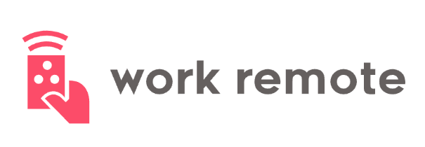

# work-remote

## Project Requirements: (see Example Proposal)
YOU must be present for everyday of project week

Must use Node.js and Express.js to create a RESTful API

Must be backed by a MySQL Database with a Sequelize ORM 

Must have both GET and POST routes for retrieving and adding new data

Must utilize at least one new library, package, or technology 
that we haven’t discussed

Must have folder structure that meets MVC Paradigm

Must meet good quality coding standards (indentation, scoping, naming)

Must be deployed using Heroku (with Data)

Must include authentication (express-session and cookies)

Must protect API keys and sensitive information with environment variables

Must have a polished frontend / UI

Have a quality README (with unique name, description, technologies used, screenshot, and link to deployed application).

Must utilize Git Branching / Merging. Git Branches based on Feature Built / GitHub Project Card, minimum of 30 meaningful commits per contributor.

## Nice To Haves:
Use Handlebars.js as the template engine

Use an existing public API to populate the database

Create a migration strategy for sharing data across team members (seed files).

Practice check-ins

Standups

Pairing

Share your AH-HA (learning moments)

Agile Playbacks

## Presentation Requirements 
You will also be responsible for preparing a 10-15 minute presentation.
This will be a formal presentation.
Every member of the group is expected to be able to speak to any section of the application
Demo a Deployed Application
One in which you explain in detail:
Your overall application’s concept
The motivation for its development
Your design process
The technologies you used 
A demonstration of its functionality
Directions for future development
Presentation Template 

Your presentations are a reflection of the work that you have done as a team. We should have a clear understanding of what the application does, why it was built, and how it was built before we ever experienced your application demo.

Your presentation should translate easily to your informative README. 

Presentation 
Description of what it does w/ Visual Support: Gif / Image of your app doing it.
Motivation for building this w/ Research you did: Into existing apps how is this different how is this the same?
How did you build it out? w/ Infographic of your work-flow
User Stories => Features => task => Branches => Git Commits
User Stories w/ Gif of your application UI completing that user story
Planning Wireframe w/ Side by Side of initial Wireframe vs. end product
Task Assignment => Who did what?
Team work-flow => Working Agreements Stand-ups Playbacks
API Research….

See Presentation Template for more details

Presentation Template
https://docs.google.com/presentation/d/18rNcdRfPpaCxi-EBSGB9dcIg6RIrbvu9RsMitvUdAB4/edit?usp=sharing
