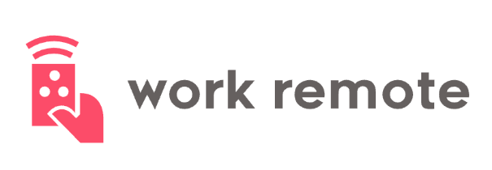

## Technology Used 

  
  

 

 

## Description 

[Visit the Deployed "Work Remote" site](https://youtu.be/BFyeuLhjcPY) 👀

The Global Remote Workplace Services Market size is estimated to grow from USD 20.1 billion in 2022 to USD 58.5 billion by 2027, at a Compound Annual Growth Rate (CAGR) of 23.8% during the forecast period, according to a report by MarketsandMarkets.  This is a HUGE market (currently 20.1 Billion),  that is increasing at a staggering rate (23.8% annually).  

How does a person find remote work opportunities? There needs to be a way for people needing remote work to be done to find people capable of doing that work. 

This project which we have named “Work Remote” provides the ability for people who need remote work to be done to post their projects.  And for people looking to do remote work, to find those projects and contact the person who posted it. Work Remote is a job board for remote workers.

## Table of Contents 

* [How To Install](#how-to-install)
* [Usage](#usage)
* [Learning Points](#learning-points)
* [Author Info](#author-info)
* [License](#license)
* [Badges](#badges)
* [Features](#features)

## How To Install

## Usage

## Learning Points 

This is a good place to Explain what you Learned by creating this application.
This is a great way to remind about all of the Complex Skills you now have.
If the user is less experienced than you:
They will be impressed by what you can do!

If the user is more experienced than you:
They will be impressed by what you can do!

Remember, it is easy to forget exactly how Valuable and Impressive your skills are, as well as How Much You’ve Learned!
So quantify that here!

## Author Info

### Jorge Castro

### Nhi Hoang

### Steven Sills II

## License

## Badges

## Features

If your project has a lot of features, consider adding a heading called "Features" and listing them there.
